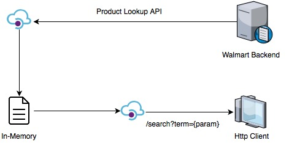

# Walmart Product Lookup

## Introduction


* When a user searches for an item, it invokes Walmart Product Lookup API and the results are compressed to a lighter model.

```javascript
{
    id: <itemId>,
    name: <itemName>,
    shortDescription: <shortDescription>,
    longDescription: <longDescription>
}
```

* Then a forward index is constructed for the user input search term.
* A 'GET' endpoint is exposed to access the results.

## External APIs Used
* Walmart Product Lookup API

## Tools
* Brackets I/O
* Postman

## Tech Stack
* NodeJS
* hapi
* Wreck HTTP Client Utilities
* Good File and Good Squeeze for Logging

## Future Work
* Improve forward index with term count (currently complicated due to pending [Stage 1 Proposal](https://github.com/tc39/proposal-optional-chaining) for optional chaining capabilities on JavaScript)
* Use Mongoose to replace in-memory DB with MongoDB.
* Use Joi to validate models after DB replacement.
* Caching
* Performance Load Testing